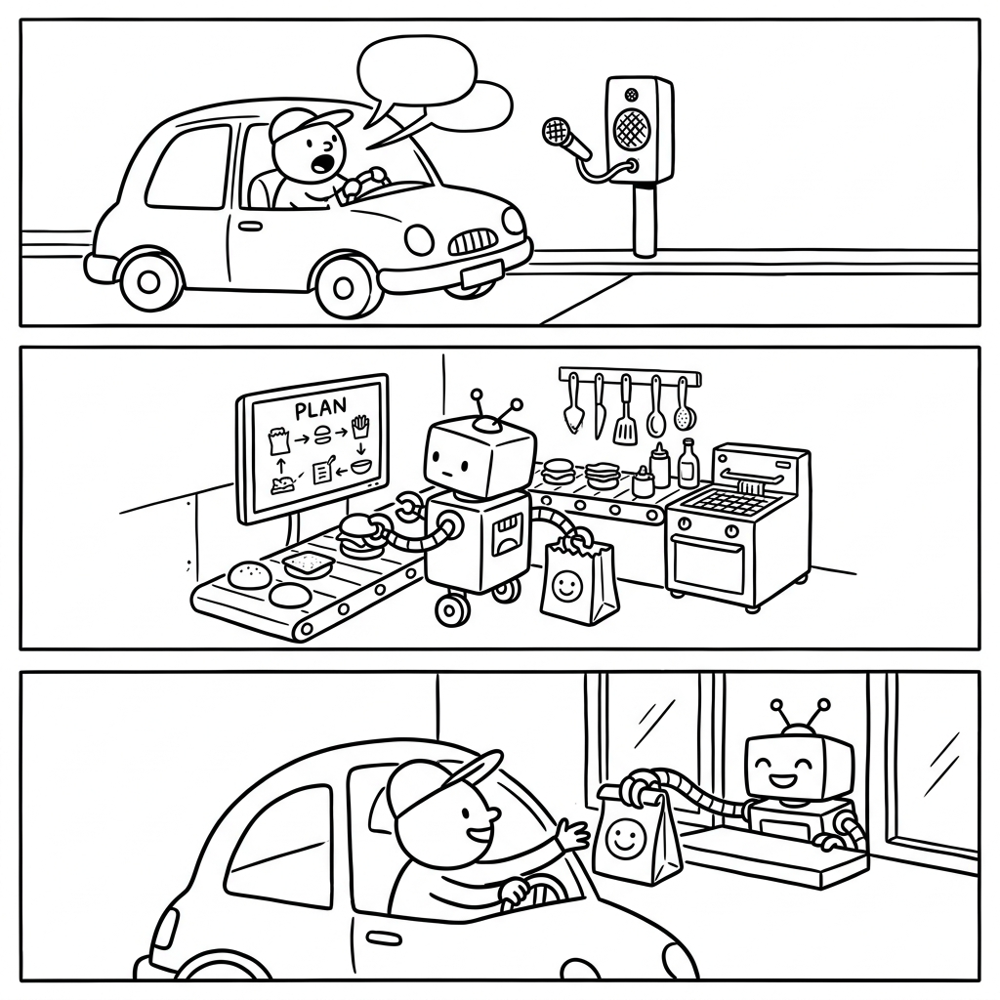

<div align="center">
  
  <h1>Workshop: How To Build A Deep Agent Harness</h1>
  <p><strong>Presented by ArtiPortal.com</strong></p>
  <h3>Build, Customize, and Deploy "Batteries-Included" Agents.</h3>
</div>

---

## 🗺️ Workshop Roadmap

*   🏁 **[Quick Start](#-quick-start)**: Prerequisites and Key Configuration.
*   🚀 **[Module 1: Your First Agent](#-module-1-your-first-agent)**: The "Health Check" Harness.
*   🔧 **[Module 2: Customizing Brain & Hands](#-module-2-customizing-brain--hands)**: Model Swaps and Custom Tools.
*   🤝 **[Module 3: Delegated Authority](#-module-3-delegated-authority)**: The Sub-Agent Pattern.
*   🏗️ **[Advanced Agentic Patterns](#️-advanced-agentic-patterns)**: The Course Catalog.
*   🧪 **[Module 4: Benchmarking Trajectories](#-module-4-benchmarking-trajectories)**: Measuring Accuracy and Depth.
*   🛑 **[Workshop Cleanup](#-workshop-cleanup--security)**: Teardown and Cost Control.
*   📚 **[Resources & Further Reading](#-resources--further-reading)**: Deep Dives and Support.

---

Welcome to the **Deep Agents Workshop**! This hands-on guide will transform you from an agent enthusiast into a developer capable of deploying production-ready AI agents using the Deep Agents framework and LangGraph.

At its core, Deep Agents is an **Agent Harness**. While most LLM implementations focus on the model, a harness focus on the **plumbing**: the state management, tool-calling loops, planning logic, and context compression required for a reliable system. By building on [LangGraph](https://github.com/langchain-ai/langgraph), Deep Agents provides a robust, stateful architecture that handles complex cycles and human-in-the-loop interactions with ease.

This workshop, curated by **ArtiPortal.com**, is designed to bridge the gap between "cool demos" and "functional software."

## 📖 How to Use This Workshop

To get the most out of this material, look out for the following instructional markers:

| Icon | Purpose | What to do |
| :--- | :--- | :--- |
| 🚀 | **Module** | Core technical narrative and follow-along code. |
| 🧪 | **Lab Challenge** | Active learning! A task for you to solve using new skills. |
| 🔍 | **Deep Dive** | Under-the-hood explanation of the "Why" behind the code. |
| 🛑 | **Common Gotcha** | Preventive troubleshooting for common friction points. |
| ✅ | **Self-Check** | Quick reflection questions to verify your understanding. |

---

## 🎯 Learning Objectives

By the end of this workshop, you will be able to:
1.  **Architect** a production-ready agent harness using the `create_deep_agent` factory.
2.  **Configure** multi-provider LLM orchestration (e.g., Anthropic for reasoning, OpenAI for tools).
3.  **Implement** autonomous planning and sub-agent delegation for multi-faceted tasks.
4.  **Execute** a terminal-based TUI coding assistant using the Deep Agents CLI.
5.  **Optimize** token efficiency through automated context management and summarization.

---

## 🏗️ The Workshop Tech Stack

To build modern, production-grade agents, we've curated a high-performance stack. Here is the breakdown of what runs locally versus what requires cloud access.

| Technology | Category | Purpose | Setup Required |
| :--- | :--- | :--- | :--- |
| **Python 3.10+** | 💻 Local | Core Runtime | [Download](https://www.python.org/downloads/) |
| **[uv](https://astral.sh/uv/)** | 💻 Local | Dependency Manager | `curl -LsSf https://astral.sh/uv/install.sh \| sh` |
| **Deep Agents SDK** | 📦 Package | The Agent Harness | `uv add deepagents` |
| **Anthropic / OpenAI** | ☁️ SaaS | Reasoning & Tools | API Keys & Credits |
| **[LangSmith](https://smith.langchain.com/)** | ☁️ SaaS | Observability | Account & API Key |
| **[Tavily](https://tavily.com/)** | ☁️ SaaS | Web Search | API Key (Free Tier available) |
| **[Modal](https://modal.com/)** | ☁️ SaaS | Remote GPU Sandbox | Account & `uv run modal setup` |

### 🔍 Deep Dive: The Hybrid Architecture
This workshop uses a **Hybrid Infrastructure** model. The "Brain" (LLM) and "Eyes" (Search) live in the cloud to minimize your local hardware requirements, while the "Hands" (State management, File I/O) live on your local machine for maximum security and control.

---

## 🛠️ Module 0: Prerequisites & Setup

Before we start, ensure your environment is ready.

> [!IMPORTANT]
> This workshop assumes you have Python 3.10+ and a valid API key for an LLM provider (OpenAI is default).

### 1. Installation
We recommend using `uv` for lightning-fast dependency management, but `pip` works too.

```bash
# Recommended: Using uv
uv add deepagents

# Traditional: Using pip
pip install deepagents
```

### 2. Environment Configuration
Export your API keys to your shell:

```bash
export OPENAI_API_KEY="your-key-here"
# Optional: For Anthropic models
export ANTHROPIC_API_KEY="your-key-here"
```

---

## 🚀 Module 1: Your First Agent

In this module, we'll run a "Health Check" agent. Deep Agents provides a `create_deep_agent()` factory that sets up planning, filesystem tools, and context management out of the box.

### The Code
Create a file named `simple_agent.py`:

```python
from deepagents import create_deep_agent

# Initialize the agent with smart defaults
# This includes planning, file access, and sub-agent capabilities
agent = create_deep_agent()

# Execute a research task
result = agent.invoke({
    "messages": [
        {"role": "user", "content": "Explain the difference between an Agent and a Chain."}
    ]
})

# Print the final response
print(result["messages"][-1].content)
```

> [!NOTE]
> **Wait, why?** In high-stakes environments, you don't want an agent starting from scratch. By using a harness, the agent inherits a pre-defined "memory" of how to plan and use files, drastically reducing the number of turns needed to solve a problem.

### 🛑 Common Gotcha: API Key Scope
If you see an "Authentication Error," ensure your `OPENAI_API_KEY` is exported in the **same** terminal session where you run the script. API keys do not persist across different terminal windows unless added to your `.zshrc` or `.bashrc`.

### ✅ Module 1 Self-Check
- What is the difference between a `create_deep_agent()` and a standard LangChain `ChatOpenAI` call?
- In the `result`, why is the final message usually an `AIMessage`?

---

## 🔧 Module 2: Customizing Brain & Hands

Now, let's make the agent our own. We'll swap the model to Claude 3.5 Sonnet and add a custom tool.

### Learning Lab: The Weather Agent
Create `custom_agent.py`:

```python
from langchain.chat_models import init_chat_model
from langchain.tools import tool
from deepagents import create_deep_agent

@tool
def get_weather(city: str):
    """Get the current weather for a specific city."""
    # In a real app, you'd call an API here
    return f"The weather in {city} is sunny, 72°F."

# 1. Swap the model (Requires anthropic-sdk)
model = init_chat_model("anthropic:claude-3-5-sonnet-latest")

# 2. Re-create the agent with custom components
agent = create_deep_agent(
    model=model,
    tools=[get_weather],
    system_prompt="You are a friendly travel assistant."
)

# Test it out!
agent.invoke({"messages": [{"role": "user", "content": "What's the weather in Tokyo?"}]})
```

---

## 🧠 Module 3: Sub-Agents & Task Planning

Deep Agents excels at **Planning**. It uses a `write_todos` tool to break down complex goals into smaller pieces.

### Visualizing the Flow
### 🔍 Deep Dive: The Planning Cycle
Deep Agents uses a "Write-Then-Execute" pattern. When a complex prompt is received, the agent doesn't start calling tools immediately. Instead, it calls `write_todos`, which updates a stateful list in the LangGraph memory. This list serves as a **dynamic anchor**, preventing the agent from "getting lost" in long-running tasks.

### ✅ Module 3 Self-Check
- How does the `task` tool maintain a separate context window from the main agent?
- What would happen if the `researcher` sub-agent failed? Does it stop the whole process? (Hint: See "Error Handling" in the full docs).

### Challenge: Multi-Step Research
Try asking the agent to:
*"Research the top 3 AI papers of 2024, write a summary for each to a new file 'research.txt', and then create a sub-task to check for any critical critiques of those papers."*

---

## 🖥️ Module 4: The Deep Agents CLI

The SDK also powers a **TUI (Terminal User Interface)**. This is a "batteries-included" coding assistant that runs in your terminal.

### Installation & Run
```bash
# One-line installer
curl -LsSf https://raw.githubusercontent.com/langchain-ai/deepagents/main/libs/cli/scripts/install.sh | bash

# Fire it up
deepagents
```

**Key Features to Try:**
- `/slash` commands for quick actions.
- Web search directly from the prompt.
- Background execution of shell commands.

---

## 🌍 Exploration: Advanced Patterns

The core modules covered the foundation. To see how these principles scale to production architectures, explore the **Advanced Patterns** in our examples directory. Each example demonstrates a specific agentic behavior:

| Pattern | Example | Learning Outcome |
| :--- | :--- | :--- |
| 🚀 **Recursive** | [deep_research](examples/deep_research/) | Master the "Thinking Tool" for multi-step web research and strategic reflection. |
| 🏎️ **Heterogeneous** | [nvidia_deep_agent](examples/nvidia_deep_agent/) | Orchestrate frontier models with specialized GPU-accelerated research nodes. |
| 🎨 **Asset Pipeline** | [content-builder](examples/content-builder-agent/) | Bundle persona memory, task skills, and image generation into a content engine. |
| 📊 **Disclosure** | [text-to-sql](examples/text-to-sql-agent/) | Implement progressive schema exploration for lean, efficient SQL agents. |
| 🔁 **Persistent** | [ralph_mode](examples/ralph_mode/) | Build long-running project loops with fresh context and Git-based memory. |
| 📦 **Portable** | [downloading](examples/downloading_agents/) | Distribute and version "Brain Folders" as portable agent artifacts. |
| 🌐 **Distributed** | [async-subagent](examples/async-subagent-server/) | Scale agents across infrastructure using the async Agent Protocol. |

> [!TIP]
> **Recommended Path**: Start with `deep_research` to understand planning, then move to `async-subagent` to see how to host your agents as services.

---

## 🏁 Completion & Next Steps

Congratulations! You've successfully navigated the core features of Deep Agents.

### 📚 Resources for Further Learning
- **[Full Documentation](https://docs.langchain.com/oss/python/deepagents/overview)**: Deep dives into ACP, custom skills, and sandboxing.
- **[Examples Directory](examples/)**: Explore pre-built patterns for different domains.
- **[ArtiPortal Workshops](https://artiportal.com/workshops)**: More interactive AI training.

### 🆘 Support & Community
- **Lab Support**: If you need help with the workshop labs, please contact **labs@artiportal.com**.
- **GitHub Issues**: Report bugs or request features.
- **LangChain Forum**: Connect with other agent builders.

---

<div align="center">
  <p>© 2026 ArtiPortal.com Workshop Material | Based on the MIT-licensed LangChain Deep Agents Project</p>
</div>

---

## 📝 Workshop Summary & Key Takeaways

As we conclude this workshop, let's recap the core pillars that make Deep Agents a powerful choice for your AI stack:

1.  **Framework over Feature**: Deep Agents isn't just a tool; it's a structural harness. It solves the "blank page" problem by providing a pre-configured LangGraph architecture that tracks state and history automatically.
2.  **Autonomous Planning**: Through the `write_todos` tool, the agent doesn't just guess its next step—it creates a structured roadmap and follows it, significantly reducing mid-task drift.
3.  **Modular Power**: You've seen how easy it is to swap "Frontier" models (like GPT-4o or Claude 3.5) while keeping your custom tools and system prompts intact. This provider-agnostic approach future-proofs your applications.
4.  **Operational Efficiency**: Features like auto-summarization and file-based tool outputs aren't just "nice to have"—they are essential for managing token costs and staying within context window limits.

**Final Challenge**: Take the `custom_agent.py` you built in Module 2 and try integrating it with the Sub-Agent logic from Module 3. Can you build an agent that researches a city *and* provides a weather-based travel itinerary in a single run?

---

## 🛑 Workshop Cleanup & Security

To prevent unexpected costs and protect your infrastructure, please follow these teardown steps once you have completed the workshop.

### 1. Revoke API Keys
Cloud providers charge based on usage. If your keys are leaked, you are responsible for the costs.
- **OpenAI/Anthropic**: Log in to your developer dashboard and **Revoke** the specific keys used for this workshop.
- **Tavily/LangSmith**: Delete the API keys or set a usage limit to prevent overages.

### 2. Shutdown Remote Infrastructure
- **Modal**: Run `modal token profile list` and ensure no active sandboxes are running. If you used `langgraph dev`, the server stops when you close the terminal, but any persistent remote threads should be deleted via the LangGraph Cloud or Studio dashboard.
- **Local Servers**: Ensure all `uvicorn` or `langgraph dev` processes are terminated (Ctrl+C).

### 3. Clear Environment Variables
If you added keys to your `.zshrc` or `.bashrc`, remove them. For project-specific keys, delete any `.env` files:
```bash
rm .env
unset OPENAI_API_KEY ANTHROPIC_API_KEY TAVILY_API_KEY LANGSMITH_API_KEY
```

### 4. Secure the Filesystem
The agent may have created files in `research/`, `blogs/`, or `tmp/`. Review these for any sensitive company data and delete them if they are no longer needed.

---

**Thank you for participating!** We look forward to seeing what you build next.

---

## 📖 Glossary of Terms

| Term | Definition |
| :--- | :--- |
| **Agent Harness** | The structural "plumbing" (state, tools, memory) that wraps around an LLM to make it functional. |
| **Skill** | A specific, file-based instruction (`SKILL.md`) that teaches the agent a new capability on the fly. |
| **Memory** | Persistent instructions stored in `AGENTS.md` that define the agent's persona and rules. |
| **Sub-Agent** | A specialized agent spawned by a "Supervisor" to handle a specific sub-task in isolation. |
| **LangGraph** | The underlying orchestration engine that manages the agent's stateful, cyclic workflow. |
| **TUI** | Terminal User Interface—the rich, interactive visual system used by the Deep Agents CLI. |
## 📚 Resources & Further Reading

> [!NOTE]
> **Origin & Acknowledgements**
> This repository is a specialized workshop fork of the original [Deep Agents](https://github.com/langchain-ai/deepagents) project by LangChain, Inc. It has been restructured and enhanced with pedagogical scaffolding, lab exercises, and detailed architectural guides for educational purposes by **ArtiPortal.com**.

Expanding your agentic knowledge doesn't stop here. Use these resources to go deeper:

### 🔰 Basic Material
- **[Intro to Agents (LangChain Docs)](https://python.langchain.com/docs/concepts/agents/)**: Understanding the core primitives.
- **[LangChain Academy](https://academy.langchain.com/)**: Fast-paced courses on building with LangGraph.

### 🧪 Advanced Deep Dives
- **[Deep Research Pattern](examples/deep_research/README.md)**: Explore recursive search and task-based reflection loops.
- **[Multi-Agent Orchestration](examples/async-subagent-server/README.md)**: Learn how to manage supervisor-subagent communication.
- **[The Agentic RAG Pipeline](examples/text-to-sql-agent/README.md)**: Deep dive into structured data retrieval.

### 🛠️ Developer Tools
- **[Deep Agents SDK Reference](libs/deepagents/README.md)**: Technical documentation for the core harness.
- **[LangSmith Dashboard](https://smith.langchain.com/)**: Visualize and debug every agent turn in live time.

### 🆘 Need Help?
If you're stuck on a lab or need clarification, reach out to **labs@artiportal.com**.

---
*Deep Agents Workshop | Built and maintained by ArtiPortal.com*
