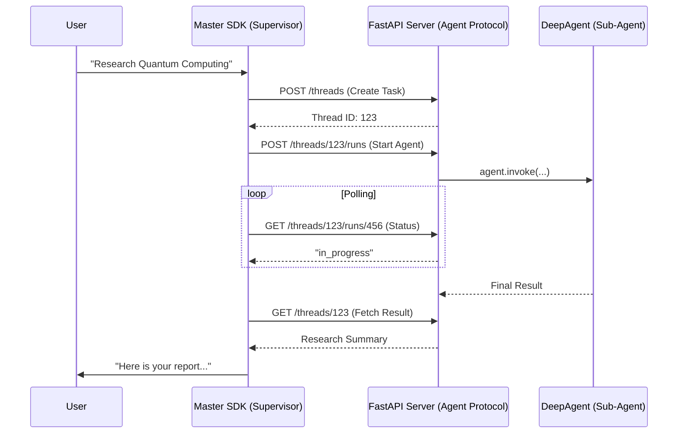

# 🌐 Async Subagent Server

This example demonstrates the **Remote Control Pattern**. It shows how to host a Deep Agent as a self-contained microservice using the [Agent Protocol](https://github.com/langchain-ai/agent-protocol). This is essential for scaling agents across different infrastructure (e.g., running a heavy research agent on a GPU cluster while the supervisor runs on a lightweight edge device).

### 🔍 Deep Dive: The Agent Protocol
The Agent Protocol is a communication standard that decouples the "Supervisor" from the "Subagent." Instead of direct function calls, the Supervisor submits a **Task** (POST /threads) and then **Polls** for a result. This asynchronous nature is what allow the system to handle long-running research tasks (30s to 5 mins) without blocking the main event loop.

### Architecture Overview



## 🛠️ Module Setup

### Prerequisites
- Python 3.10+
- `ANTHROPIC_API_KEY`: Required for the subagent brain.
- `TAVILY_API_KEY`: Optional; used if the subagent needs web search.

### Installation & Launch

```bash
cd examples/async-subagent-server
uv sync

# 1. Start the Subagent Server
uv run uvicorn server:app --port 2024

# 2. In another terminal, run the Supervisor
uv run python supervisor.py
```

### 🛑 Troubleshooting & Common Pitfalls
- **"Connection Refused"**: Ensure the server is actually running on port 2024 before starting the supervisor.
- **"Polling Timeout"**: If a task takes too long, the supervisor might stop polling. Check the `timeout` settings in `supervisor.py`.
- **"Zombie Runs"**: If you stop the server abruptly, the SDK might not be able to clean up the thread state. Use the `DELETE /threads` endpoint to clear stuck tasks.

### ✅ Self-Check Challenge
- Look at `server.py`. How does the code handle an `interrupt` signal from the supervisor?
- Try adding a new endpoint `GET /metrics` that returns the number of active runs currently being handled by the subagent.

- `ANTHROPIC_API_KEY` — required
- `TAVILY_API_KEY` — optional; stub search is used if not set

## Quickstart

**1. Install dependencies:**

```bash
cd examples/async-subagent-server
uv sync
```

**2. Set up your environment:**

```bash
cp .env.example .env
# fill in ANTHROPIC_API_KEY (and optionally TAVILY_API_KEY)
```

**3. Start the server:**

```bash
uv run uvicorn server:app --port 2024
```

**4. In another terminal, start the supervisor:**

```bash
cd examples/async-subagent-server
ANTHROPIC_API_KEY=... uv run python supervisor.py
```

Try these prompts:

```
> research the latest developments in quantum computing
> check status of <task-id>
> update <task-id> to focus on commercial applications only
> cancel <task-id>
> list all tasks
```

## Implemented endpoints

These are the Agent Protocol endpoints the DeepAgents async subagent middleware calls (via the LangGraph SDK):

| Endpoint | Purpose |
| -------------------------------------------- | -------------------------------- |
| `POST /threads` | Create a thread for a new task |
| `POST /threads/{thread_id}/runs` | Start or interrupt+restart a run |
| `GET /threads/{thread_id}/runs/{run_id}` | Poll run status |
| `GET /threads/{thread_id}` | Fetch thread state (`values.messages`) |
| `POST /threads/{thread_id}/runs/{run_id}/cancel` | Cancel a run |
| `GET /ok` | Health check |

## Swap in your own agent

Replace the `create_deep_agent` call in `server.py` with your own agent. The Agent Protocol layer stays the same regardless of what the agent does.

```python
_agent = create_deep_agent(
    model=ChatAnthropic(model="claude-sonnet-4-5"),
    system_prompt="You are a ...",
    tools=[your_tool],
)
```

## ⚠️ For demonstration purposes only

This example is intended to illustrate the self-hosted async subagent pattern. It does not feature authentication, rate limiting, or other features required for production use.

---

[⬅️ Back to Course Catalog](../README.md)
