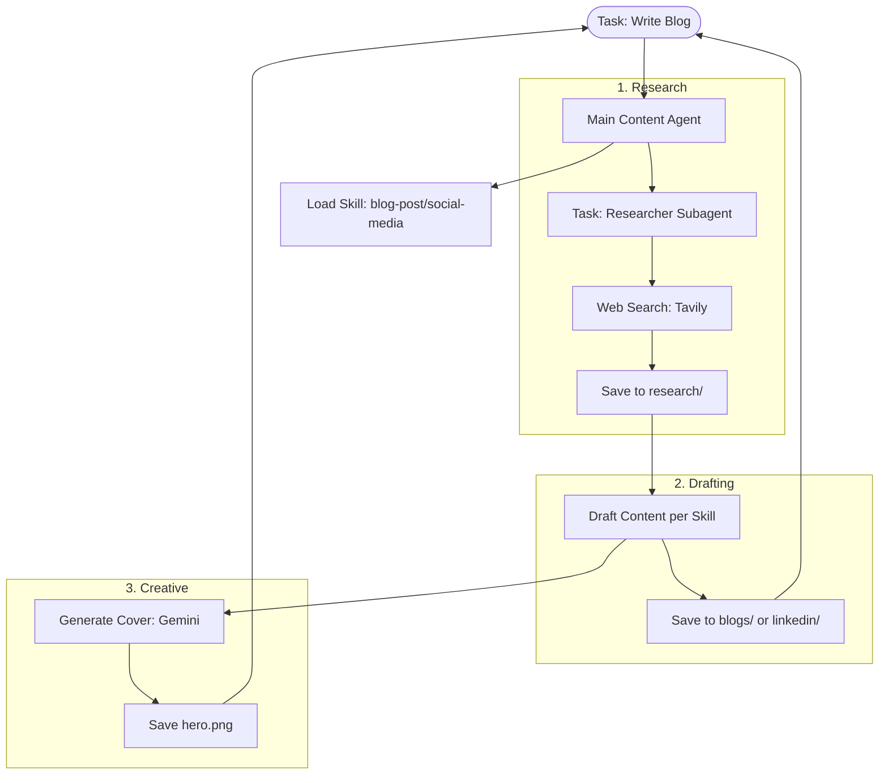

# 🎨 Content Builder Agent

This example demonstrates the **Multi-Modal Asset Pattern**. It shows how a single orchestrator can use **Memory**, **Skills**, and **Subagents** to produce a complete content package: a researched blog post paired with AI-generated hero images and social media snippets.

### 🔍 Deep Dive: The Three Primitives of an Agent
Deep Agents are built on three foundational layers:
1.  **Memory (`AGENTS.md`)**: The "Soul"—defines the brand voice, tone, and editorial standards.
2.  **Skills (`skills/`)**: The "Talent"—specialized workflows for different formats (Blog vs LinkedIn).
3.  **Subagents (`subagents.yaml`)**: The "Staff"—delegated workers for tasks like depth research or image generation.

By separating these, you can update a brand voice for an entire organization without changing a single line of logic in the skills.

### Content Creation Pipeline



## 🛠️ Module Setup

### Prerequisites
- Python 3.11+
- **API Keys**:
    - `ANTHROPIC_API_KEY`: For the main writer brain.
    - `GOOGLE_API_KEY`: For the `generate_cover` tool (uses Gemini).
    - `TAVILY_API_KEY`: For the research subagent.

### Installation & Launch

```bash
cd examples/content-builder-agent
uv sync

# Run the builder for a specific topic
uv run python content_writer.py "Write a blog post about prompt engineering"
```

### 🛑 Troubleshooting & Common Pitfalls
- **"Image generation failed"**: This example uses Gemini for images. Ensure your `GOOGLE_API_KEY` has access to the Imagen models.
- **"Voice is too robotic"**: If the output doesn't match your brand, edit `AGENTS.md`. This file is the primary source of truth for the agent's writing style.

### ✅ Self-Check Challenge
- Look at `skills/blog-post/SKILL.md`. What specific sections of a blog post does the agent try to write first?
- Try creating a new skill folder `newsletter/` with its own `SKILL.md`. Add a rule that every newsletter must end with a "Top 3 Links" section. Run the agent and see if it follows the new pattern!

## Output

```
blogs/
└── prompt-engineering/
    ├── post.md       # Blog content
    └── hero.png      # Generated cover image

linkedin/
└── ai-agents/
    ├── post.md       # Post content
    └── image.png     # Generated image

research/
└── prompt-engineering.md   # Research notes
```

## Customizing

**Change the voice:** Edit `AGENTS.md` to modify brand tone and style.

**Add a content type:** Create `skills/<name>/SKILL.md` with YAML frontmatter:
```yaml
---
name: newsletter
description: Use this skill when writing email newsletters
---
# Newsletter Skill
...
```

**Add a subagent:** Add to `subagents.yaml`:
```yaml
editor:
  description: Review and improve drafted content
  model: anthropic:claude-haiku-4-5-20251001
  system_prompt: |
    You are an editor. Review the content and suggest improvements...
  tools: []
```

**Add a tool:** Define it in `content_writer.py` with the `@tool` decorator and add to `tools=[]`.

## Security Note

This agent has filesystem access and can read, write, and delete files on your machine. Review generated content before publishing and avoid running in directories with sensitive data.

## Requirements

- Python 3.11+
- `ANTHROPIC_API_KEY` - For the main agent
- `GOOGLE_API_KEY` - For image generation (uses Gemini's [Imagen / "nano banana"](https://ai.google.dev/gemini-api/docs/image-generation) via `gemini-2.5-flash-image`)
- `TAVILY_API_KEY` - For web search (optional, research still works without it)

---

[⬅️ Back to Course Catalog](../README.md)
