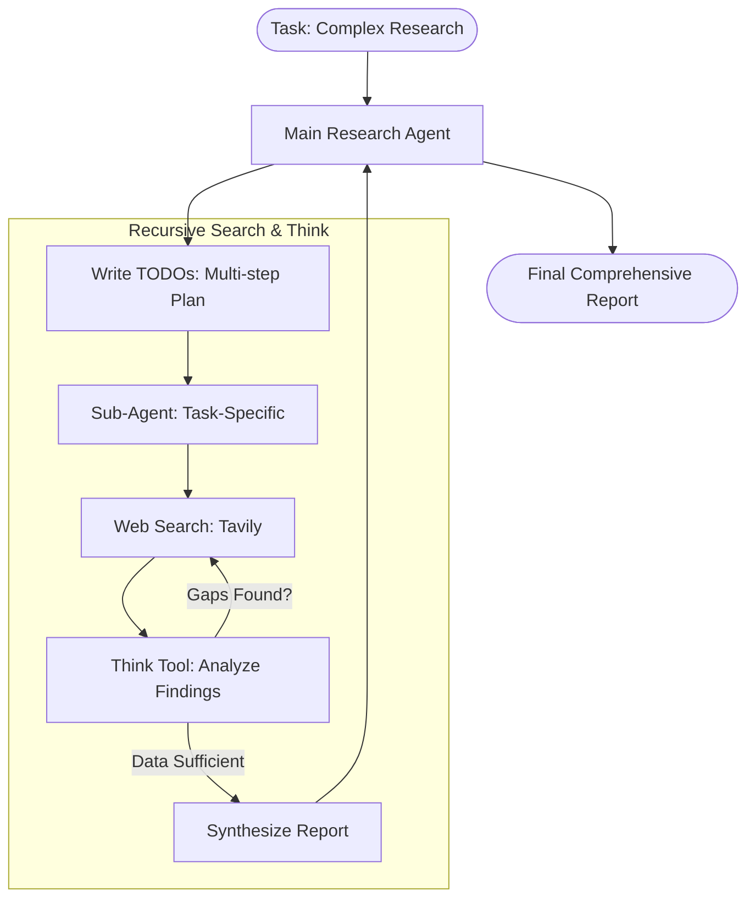

# 🚀 Deep Research Agent

This example showcases a **Recursive Research Pattern**. Unlike simple search agents, this agent pauses to "think" after every search, identifies gaps in its current knowledge, and recursively iterates until it has a complete answer.

### 🔍 Deep Dive: The Thinking Tool
The `think_tool` is the secret sauce. While searching provides raw data, the `think_tool` provides **metacognition**. It allows the agent to reason about its progress: *"Do I have enough on the 2024 pricing models for XYZ? No. I need to search for specifically the 'enterprise' tier."* This prevents the agent from just dumping a bunch of search results and calling it a day.

### Architecture Overview



## 🛠️ Module Setup

### Prerequisites
- Python 3.11+
- **API Keys**:
    - `ANTHROPIC_API_KEY`: For the high-reasoning Claude model.
    - `TAVILY_API_KEY`: For grounding research in live web data.
    - `GOOGLE_API_KEY`: Required if using Gemini models.

### Installation & Launch

```bash
cd examples/deep_research
uv sync

# Option 1: Fast Start (CLI)
uv run python agent.py "How does deepagents context management work?"

# Option 2: Visual Debugging (Studio)
langgraph dev
```

### 🛑 Troubleshooting & Common Pitfalls
- **"Search results are empty"**: Ensure your `TAVILY_API_KEY` is valid. Deep research relies heavily on external data.
- **"Agent is looping too many times"**: Check the `MAX_ITERATIONS` setting in `agent.py`. For complex research, 3-5 rounds is normal. 
- **"Context Overflow"**: If the research is massive, ensure the `deepagents` auto-summarization is enabled (it is by default in this harness).

### ✅ Self-Check Challenge
- Look at `utils.py`. How does the `think_tool` actually feed back into the next search?
- Try changing the `system_prompt` to force the agent to cite its sources in a specific [ML/BIB] format. How does the "Thinking" process change to accommodate this rule?

You can run this example in two ways:

### Option 1: Jupyter Notebook

Run the interactive notebook to step through the research agent:

```bash
uv run jupyter notebook research_agent.ipynb
```

### Option 2: LangGraph Server

Run a local [LangGraph server](https://langchain-ai.github.io/langgraph/tutorials/langgraph-platform/local-server/) with a web interface:

```bash
langgraph dev
```

LangGraph server will open a new browser window with the Studio interface, which you can submit your search query to:


You can also connect the LangGraph server to a [UI specifically designed for deepagents](https://github.com/langchain-ai/deep-agents-ui):

```bash
git clone https://github.com/langchain-ai/deep-agents-ui.git
cd deep-agents-ui
yarn install
yarn dev
```

Then follow the instructions in the [deep-agents-ui README](https://github.com/langchain-ai/deep-agents-ui?tab=readme-ov-file#connecting-to-a-langgraph-server) to connect the UI to the running LangGraph server.

This provides a user-friendly chat interface and visualization of files in state.


## 📚 Resources

- **[Deep Research Course](https://academy.langchain.com/courses/deep-research-with-langgraph)** - Full course on deep research with LangGraph

### Custom Model

By default, `deepagents` uses `"claude-sonnet-4-5-20250929"`. You can customize this by passing any [LangChain model object](https://python.langchain.com/docs/integrations/chat/). See the Deep Agents SDK [README](../../libs/deepagents/README.md) for more details.

```python
from langchain.chat_models import init_chat_model
from deepagents import create_deep_agent

# Using Claude
model = init_chat_model(model="anthropic:claude-sonnet-4-5-20250929", temperature=0.0)

# Using Gemini
from langchain_google_genai import ChatGoogleGenerativeAI
model = ChatGoogleGenerativeAI(model="gemini-3-pro-preview")

agent = create_deep_agent(
    model=model,
)
```

### Research & Reflection Loop


### Custom Instructions

The deep research agent uses custom instructions defined in `research_agent/prompts.py` that complement (rather than duplicate) the default middleware instructions. You can modify these in any way you want.

| Instruction Set | Purpose |
|----------------|---------|
| `RESEARCH_WORKFLOW_INSTRUCTIONS` | Defines the 5-step research workflow: save request → plan with TODOs → delegate to sub-agents → synthesize → respond. Includes research-specific planning guidelines like batching similar tasks and scaling rules for different query types. |
| `SUBAGENT_DELEGATION_INSTRUCTIONS` | Provides concrete delegation strategies with examples: simple queries use 1 sub-agent, comparisons use 1 per element, multi-faceted research uses 1 per aspect. Sets limits on parallel execution (max 3 concurrent) and iteration rounds (max 3). |
| `RESEARCHER_INSTRUCTIONS` | Guides individual research sub-agents to conduct focused web searches. Includes hard limits (2-3 searches for simple queries, max 5 for complex), emphasizes using `think_tool` after each search for strategic reflection, and defines stopping criteria. |

### Custom Tools

The deep research agent adds the following custom tools beyond the built-in deepagent tools. You can also use your own tools, including via MCP servers. See the Deep Agents SDK [README](../../libs/deepagents/README.md) for more details.

| Tool Name | Description |
|-----------|-------------|
| `tavily_search` | Web search tool that uses Tavily purely as a URL discovery engine. Performs searches using Tavily API to find relevant URLs, fetches full webpage content via HTTP with proper User-Agent headers (avoiding 403 errors), converts HTML to markdown, and returns the complete content without summarization to preserve all information for the agent's analysis. Works with both Claude and Gemini models. |
| `think_tool` | Strategic reflection mechanism that helps the agent pause and assess progress between searches, analyze findings, identify gaps, and plan next steps. |

---

[⬅️ Back to Course Catalog](../README.md)
