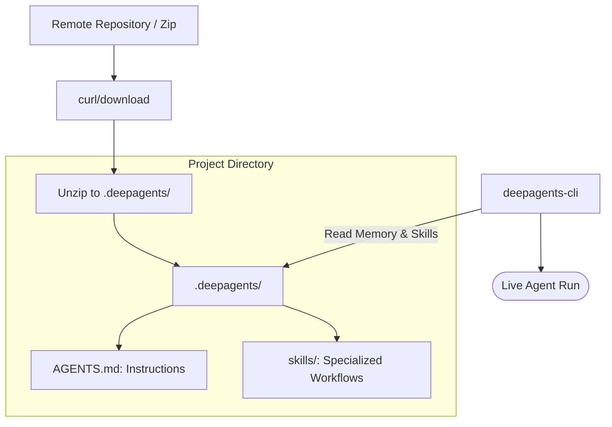

# 📦 Sharing & Downloading Agents

This example demonstrates the **Agent Architecture Pattern: ZIP-as-Package**. In Deep Agents, a "brain" isn't a complex black-box binary; it's just a folder. This means you can version, share, and audit an agent's memory and skills as easily as a source code repository.

### 🔍 Deep Dive: What is an Agent Package?
When you download a `.zip` from this example, you're getting a snapshot of an agent's "lived experience." It includes:
1.  **Memory (`AGENTS.md`)**: The core persona and operating rules.
2.  **Skills (`skills/`)**: Specialized workflows (e.g., SEO drafting, social media hooks).
3.  **Local Context**: Files that the agent has started working on.

By moving this folder between machines, you can "resume" an agent's progress or share a pre-trained "Senior Content Writer" with a colleague.

### The Sharing Pattern



## 🛠️ Module Setup

### Prerequisites
- Install the `deepagents-cli` to enable terminal interactions:
```bash
uv tool install deepagents-cli==0.0.13
```

### Quick Download & Run

```bash
# Create a fresh project
mkdir shared-agent-test && cd shared-agent-test && git init

# Download the pre-configured Content Writer agent
curl -L https://raw.githubusercontent.com/langchain-ai/deepagents/main/examples/downloading_agents/content-writer.zip -o agent.zip

# Resurrect the agent into .deepagents/
unzip agent.zip -d .deepagents

# Launch the agent in your terminal
deepagents
```

### 🛑 Troubleshooting & Common Pitfalls
- **"Agent not found"**: Ensure the `unzip` command correctly placed the `AGENTS.md` file inside `.deepagents/AGENTS.md`. If it's nested (e.g., `.deepagents/content-writer/AGENTS.md`), the CLI won't find it.
- **"Command 'deepagents' not found"**: If building from source, ensure `uv tool` or `pip` added the install directory to your system `PATH`.

### ✅ Self-Check Challenge
- Unzip the `content-writer.zip` manually. Look at its `AGENTS.md`. What specifically makes it a "Content Writer" vs a general-purpose agent?
- Try creating your own `.zip` from a previous module's agent and sharing it with a different directory on your computer. Does it maintain its memory?

```bash
uv tool install deepagents-cli==0.0.13
```

## Quick Start

```bash
# Create a project folder
mkdir my-project && cd my-project && git init

# Download the agent
curl -L https://raw.githubusercontent.com/langchain-ai/deepagents/main/examples/downloading_agents/content-writer.zip -o agent.zip

# Unzip to .deepagents
unzip agent.zip -d .deepagents

# Run it
deepagents
```

## What's Inside

```
.deepagents/
├── AGENTS.md                    # Agent memory & instructions
└── skills/
    ├── blog-post/SKILL.md       # Blog writing workflow
    └── social-media/SKILL.md    # LinkedIn/Twitter workflow
```

## One-Liner

```bash
git init && curl -L https://raw.githubusercontent.com/langchain-ai/deepagents/main/examples/downloading_agents/content-writer.zip -o agent.zip && unzip agent.zip -d .deepagents && rm agent.zip && deepagents
```

---

[⬅️ Back to Course Catalog](../README.md)
