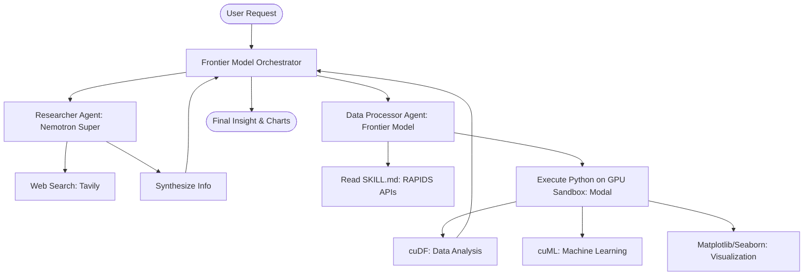

# 🏎️ Nemotron Deep Agent + GPU Skills

This example demonstrates the **Heterogeneous Agent Pattern**. It uses a "Frontier" model (like Claude 3.5 Sonnet) for high-level planning and reasoning, while delegating heavy research and data processing to specialized nodes. Specifically, it showcases how to use **NVIDIA NIMs** for research and **NVIDIA RAPIDS** for GPU-accelerated data science.

### 🔍 Deep Dive: Why GPU-Accelerated Agents?
Standard LLM tools run on CPUs, which can be slow for massive datasets or complex simulations. By connecting the agent to a **GPU Sandbox (via Modal)**, we give it the "hands" to process millions of rows in seconds using `cuDF` and `cuML`. This pattern transforms an agent from a text-processor into a high-performance data engineer.

### Architecture Overview



## 🛠️ Module Setup

### Prerequisites
- [uv](https://docs.astral.sh/uv/install.sh) installed.
- **API Keys**:
    - `ANTHROPIC_API_KEY`: For the reasoning brain (Claude).
    - `NVIDIA_API_KEY`: For the research brain (Nemotron via NIM).
    - `MODAL_TOKEN_ID` & `MODAL_TOKEN_SECRET`: For the GPU sandbox.

### Installation & Launch

```bash
cd examples/nvidia_deep_agent
uv sync

# Initialize your Modal credentials
uv run modal setup

# Start the interactive development server
uv run langgraph dev --allow-blocking
```

### 🛑 Troubleshooting & Common Pitfalls
- **"GPU Allocation Failed"**: Remote GPU providers like Modal might experience high demand. If a run fails with a quota error, try switching to `sandbox_type: "cpu"` in your context settings to verify the logic first.
- **"Library not found (cuDF)"**: Ensure you are using the RAPIDS-specific Docker image provided in the metadata. The agent automatically selects this if `sandbox_type` is set to `gpu`.

### ✅ Self-Check Challenge
- Look at `agent.py`. How does the code switch between the CPU and GPU sandbox at runtime?
- Try creating a 10,000-row dataset of "synthetic stock prices." Observe the execution time on CPU vs GPU. Which tool did the agent choose to use?

Install [uv](https://docs.astral.sh/uv/):

```bash
curl -LsSf https://astral.sh/uv/install.sh | sh
```

Install dependencies:

```bash
cd nemotron-deep-agent
uv sync
```

Set your API keys in your `.env` file or export them:

```bash
export ANTHROPIC_API_KEY=your_key    # For Claude frontier model
export NVIDIA_API_KEY=your_key       # For Nemotron Super via NIM
export TAVILY_API_KEY=your_key       # For web search
export LANGSMITH_API_KEY=your_key    # For tracing (optional)
export LANGSMITH_PROJECT="nemotron-deep-agent"
export LANGSMITH_TRACING="true"
```

Add your Modal keys to your `.env`(`MODAL_TOKEN_ID` & `MODEL_TOKEN_SECRET)`

OR

use Modal's CLI to authenticate:

```bash
uv run modal setup
```

Run with LangGraph server:

```bash
uv run langgraph dev --allow-blocking
```

## GPU vs CPU Sandbox Switching

The agent supports runtime switching between GPU and CPU sandboxes via `context_schema`. Pass `context={"sandbox_type": "gpu"}` or `context={"sandbox_type": "cpu"}` when invoking. In Studio you can change this by clicking the manage assistants button on the bottom left.

GPU mode uses the NVIDIA RAPIDS Docker image with an A10G GPU. CPU mode uses a lightweight image with pandas, numpy, and scipy.

## Try It Out

Start the server:

```bash
uv run langgraph dev --allow-blocking
```

Then open LangSmith Studio and try:

```
Generate a 1000-row random dataset about credit card transactions with columns
(id, value, category, score) use your cudf skill, then do some cool analysis
and give me some insights on that data!
```

The agent will delegate to the data-processor-agent, which reads the cuDF skill, writes a Python script to generate and analyze the dataset on the GPU sandbox, and returns structured insights with inline charts.

Resume from human in the loop interrupts in Studio by pasting:

```json
{"decisions": [{"type": "approve"}]}
```

## Example Queries

**Data Analysis**: "Generate a 1000-row random dataset about credit card transactions with columns (id, value, category, score), then analyze it for trends and anomalies"

**Research + Analysis**: "Research the latest trends in renewable energy adoption, then create a visualization comparing solar vs wind capacity growth"

**ML**: "Upload this CSV and train a classifier to predict customer churn. Show feature importances."

## Model Configuration

### Frontier model

Configured in `src/agent.py` via `init_chat_model` (supports any provider):

```python
frontier_model = init_chat_model("anthropic:claude-sonnet-4-6")
```

### Research subagent (NVIDIA Nemotron Super)

Configured via NVIDIA's NIM endpoint (OpenAI-compatible):

```python
nemotron_super = ChatNVIDIA(
    model="private/nvidia/nemotron-3-super-120b-a12b"
)
```

## GPU Sandbox

The agent uses a [Modal](https://modal.com) sandbox with the NVIDIA RAPIDS base image (cuDF, cuML pre-installed). GPU type is A10G by default.

To use a different GPU tier, modify `src/agent.py`:

```python
create_kwargs["gpu"] = "A100"  # or "T4", "H100"
```

## Skills

Skills teach the agent how to use NVIDIA libraries via the [Agent Skills Specification](https://agentskills.io/specification). Each skill is a `SKILL.md` file the agent reads when it encounters a matching task.

### cudf-analytics

GPU-accelerated data analysis using NVIDIA RAPIDS cuDF. Pandas-like API on GPU for groupby, statistics, correlation, and anomaly detection.

### cuml-machine-learning

GPU-accelerated machine learning using NVIDIA RAPIDS cuML. Scikit-learn compatible API for classification, regression, clustering, dimensionality reduction (PCA, UMAP, t-SNE), and preprocessing — all on GPU.

### data-visualization

Publication-quality charts using matplotlib and seaborn in headless mode. Includes templates for bar, line, scatter, heatmap, histogram, box plots, and multi-panel dashboard summaries with a colorblind-safe palette. Charts are displayed inline in the conversation via `read_file`.

### gpu-document-processing

Large document processing via the sandbox-as-tool pattern. Agent writes extraction scripts and runs them on GPU.

### Adding Your Own Skills

```
skills/
  my-skill/
    SKILL.md
```

## Self-Improving Memory

The agent has persistent memory via `AGENTS.md`, loaded at startup through the `memory` parameter. When the agent discovers something reusable during execution — like a library API that doesn't exist, a better code pattern, or a non-obvious error fix — it **edits its own skill files** to capture that knowledge for future runs.

For example, if the data-processor-agent discovers that `cudf.DataFrame.interpolate()` isn't implemented, it updates `skills/cudf-analytics/SKILL.md` with a "Known Limitations" note so it won't repeat the mistake.

Memory and skills are uploaded into the **sandbox** on creation via `upload_files`. The agent reads and edits them directly inside the sandbox; changes persist for the sandbox's lifetime. In production, swap the local file reads in `_seed_sandbox` for your storage layer (S3, database, etc.). See `src/backend.py` for the backend configuration.

## Adapting to Your Domain

1. **Swap prompts** in `src/prompts.py`
2. **Add/replace subagents** with domain-specific agents
3. **Add skills** for domain capabilities
4. **Change models** in `src/agent.py`
5. **Swap sandbox** for a different provider (Daytona, E2B, or local)

## Full Enterprise Version

For a full enterprise deployment with NeMo Agent Toolkit, evaluation harnesses, knowledge layer, and frontend, see **NVIDIA's AIQ Blueprint**: [https://github.com/langchain-ai/aiq-blueprint](https://github.com/langchain-ai/aiq-blueprint)

## Resources

- [Deep Agents Documentation](https://docs.langchain.com/oss/python/deepagents/overview)
- [Agent Skills Specification](https://agentskills.io/specification)
- [NVIDIA NIM](https://build.nvidia.com/)
- [Modal](https://modal.com)
- [The Two Patterns for Agent Sandboxes](https://blog.langchain.com/the-two-patterns-by-which-agents-connect-sandboxes/)

---

[⬅️ Back to Course Catalog](../README.md)
