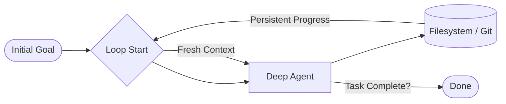

# 🔁 Ralph Mode for Deep Agents

This example demonstrates the **Stateless Conversation / Stateful Execution Pattern**. Created by Geoff Huntley, "Ralph Mode" is a minimalist approach to building long-running projects. Instead of managing complex conversation threads, the agent starts every iteration with a **fresh context** but a **persistent filesystem**.

### 🔍 Deep Dive: Filesystem as Long-Term Memory
In standard chat, if you hit the token limit, the agent "forgets" the beginning of the talk. In Ralph Mode, the agent's "history" is the code it has already written to the disk. By using `git` alongside the agent, we create a verifiable, auditable trail of progress. If the agent makes a mistake in loop 5, we can simply `git checkout` loop 4 and try again.

### The Loop Pattern



## 🛠️ Module Setup

### Prerequisites
- Python 3.10+
- `ANTHROPIC_API_KEY` (or your preferred provider).
- [uv](https://astral.sh/uv/install.sh) installed.

### Installation & Launch

```bash
cd examples/ralph_mode
uv sync

# Run Ralph for a specific goal
uv run python ralph_mode.py "Build a Python programming course for beginners. Use git."
```

### 🛑 Troubleshooting & Common Pitfalls
- **"Agent is repeating itself"**: This usually happens if the agent isn't reading the existing files before starting work. Ensure your prompt encourages "Check current progress before starting."
- **"Git merge conflicts"**: Since the agent is the only one writing, conflicts are rare. However, if you manually edit files during a run, the agent might get confused. Always pause the loop before manual edits.

### ✅ Self-Check Challenge
- Look at `ralph_mode.py`. How does it pass the "Initial Goal" into every single iteration of the loop?
- Try running Ralph with the `--iterations 3` flag. After it finishes, check the `git log`. What changed between loop 1 and loop 3?

The filesystem and git allow the agent to track progress over time. This serves as its memory and worklog.

## Quick Start

```bash
# Install uv (if you don't have it)
curl -LsSf https://astral.sh/uv/install.sh | sh

# Create a virtual environment
uv venv
source .venv/bin/activate

# Install the CLI
uv pip install deepagents-cli

# Download the script (or copy from examples/ralph_mode/ if you have the repo)
curl -O https://raw.githubusercontent.com/langchain-ai/deepagents/main/examples/ralph_mode/ralph_mode.py

# Run Ralph
python ralph_mode.py "Build a Python programming course for beginners. Use git."
```

## Usage

```bash
# Unlimited iterations (Ctrl+C to stop)
python ralph_mode.py "Build a Python course"

# With iteration limit
python ralph_mode.py "Build a REST API" --iterations 5

# With specific model
python ralph_mode.py "Create a CLI tool" --model claude-sonnet-4-6

# With a specific working directory
python ralph_mode.py "Build a web app" --work-dir ./my-project

# Run in a remote sandbox (AgentCore, Modal, Daytona, or Runloop)
python ralph_mode.py "Build an app" --sandbox modal
python ralph_mode.py "Build an app" --sandbox daytona --sandbox-setup ./setup.sh

# Reuse an existing sandbox instance
python ralph_mode.py "Build an app" --sandbox modal --sandbox-id my-sandbox

# Auto-approve specific shell commands (or "recommended" for safe defaults)
python ralph_mode.py "Build an app" --shell-allow-list recommended
python ralph_mode.py "Build an app" --shell-allow-list "ls,cat,grep,pwd"

# Pass model parameters
python ralph_mode.py "Build an app" --model-params '{"temperature": 0.5}'

# Disable streaming output
python ralph_mode.py "Build an app" --no-stream
```

### Remote sandboxes

Ralph supports running agent code in isolated remote environments via the
`--sandbox` flag. The agent runs locally but executes all code operations in the
remote sandbox. See the
[sandbox documentation](https://docs.langchain.com/oss/python/deepagents/cli/overview)
for provider setup (API keys, etc.) and the
[sandboxes concept guide](https://docs.langchain.com/oss/python/deepagents/sandboxes)
for architecture details.

Supported providers: **AgentCore**, **Modal**, **Daytona**, **Runloop**.

## How It Works

1. **You provide a task** — declarative, what you want (not how)
2. **Agent runs** — creates files, makes progress
3. **Loop repeats** — same prompt, but files persist
4. **You stop it** — Ctrl+C when satisfied

## Credits

- Original Ralph concept by [Geoff Huntley](https://ghuntley.com)
- [Brief History of Ralph](https://www.humanlayer.dev/blog/brief-history-of-ralph) by HumanLayer

---

[⬅️ Back to Course Catalog](../README.md)
