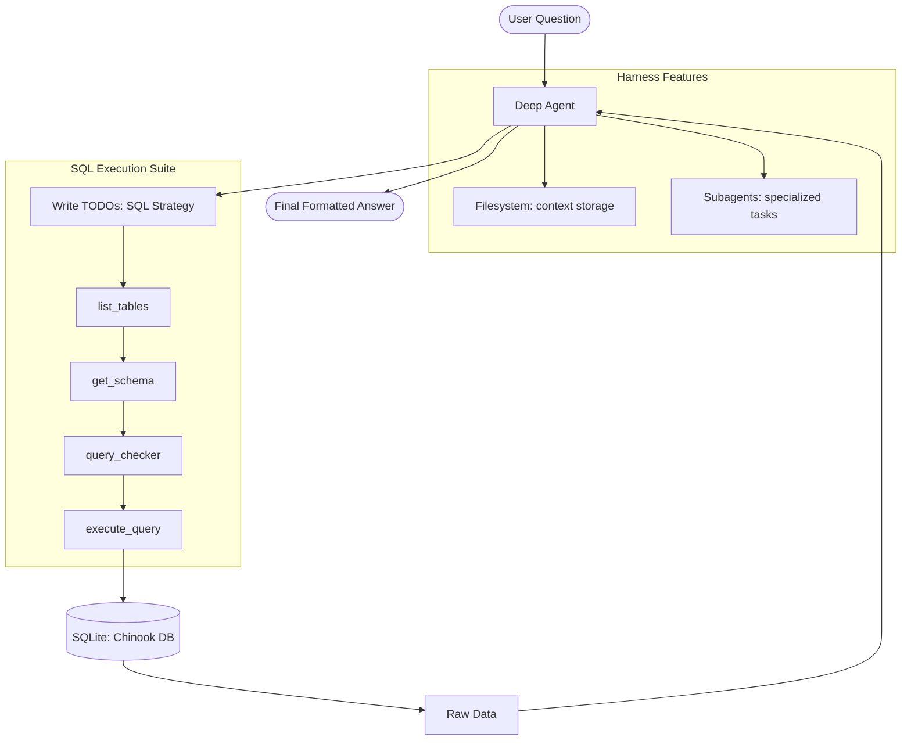

# 📊 Text-to-SQL Deep Agent

This example demonstrates the **Progressive Disclosure Pattern**. It shows how an agent can start with simple natural language inputs and dynamically "unlock" database schemas and specialized SQL skills only when needed. This approach keeps the reasoning context clean and focused on the current query.

### 🔍 Deep Dive: Why Progressive Disclosure?
Loading an entire database schema (10+ tables, hundreds of columns) into an agent's prompt causes "Context Saturation." The agent gets confused by irrelevant tables. Instead, this agent use **Schema Exploration Skills** to first list tables, then only "read" the definitions of the relevant ones (e.g., `Invoices` and `Customers`).

### Architecture Overview



## 🛠️ Module Setup

### Prerequisites
- Python 3.11+
- `ANTHROPIC_API_KEY`: For the reasoning brain (Claude).
- [uv](https://astral.sh/uv/) for dependency management.

### Installation & Launch

```bash
cd examples/text-to-sql-agent
uv sync

# Download the sample database
curl -L -o chinook.db https://github.com/lerocha/chinook-database/raw/master/ChinookDatabase/DataSources/Chinook_Sqlite.sqlite

# Run a test query
uv run python agent.py "What are the top 5 best-selling artists?"
```

### 🛑 Troubleshooting & Common Pitfalls
- **"Database file not found"**: Ensure `chinook.db` is in the same directory as `agent.py`.
- **"Invalid SQL Syntax"**: The agent uses a `query_checker` tool to catch errors. If it fails repeatedly, check if the model has enough context about the specific SQL dialect (SQLite in this case).

### ✅ Self-Check Challenge
- Look at `skills/schema-exploration/SKILL.md`. How does the agent decide which tables to examine?
- Try asking: *"Show me the relationship between Track and Genre."* How many tool calls did it take to answer?

### Configuration

Deep Agents uses **progressive disclosure** with memory files and skills:

**AGENTS.md** (always loaded) - Contains:

- Agent identity and role
- Core principles and safety rules
- General guidelines
- Communication style

**skills/** (loaded on-demand) - Specialized workflows:

- **query-writing** - How to write and execute SQL queries (simple and complex)
- **schema-exploration** - How to discover database structure and relationships

The agent sees skill descriptions in its context but only loads the full SKILL.md instructions when it determines which skill is needed for the current task. This **progressive disclosure** pattern keeps context efficient while providing deep expertise when needed.

## Example Queries

### Simple Query

```
"How many customers are from Canada?"
```

The agent will directly query and return the count.

### Complex Query with Planning

```
"Which employee generated the most revenue and from which countries?"
```

The agent will:

1. Use `write_todos` to plan the approach
2. Identify required tables (Employee, Invoice, Customer)
3. Plan the JOIN structure
4. Execute the query
5. Format results with analysis

## Deep Agent Output Example

The Deep Agent shows its reasoning process:

```
Question: Which employee generated the most revenue by country?

[Planning Step]
Using write_todos:
- [ ] List tables in database
- [ ] Examine Employee and Invoice schemas
- [ ] Plan multi-table JOIN query
- [ ] Execute and aggregate by employee and country
- [ ] Format results

[Execution Steps]
1. Listing tables...
2. Getting schema for: Employee, Invoice, InvoiceLine, Customer
3. Generating SQL query...
4. Executing query...
5. Formatting results...

[Final Answer]
Employee Jane Peacock (ID: 3) generated the most revenue...
Top countries: USA ($1000), Canada ($500)...
```

## Project Structure

```
text-to-sql-agent/
├── agent.py                      # Core Deep Agent implementation with CLI
├── AGENTS.md                     # Agent identity and general instructions (always loaded)
├── skills/                       # Specialized workflows (loaded on-demand)
│   ├── query-writing/
│   │   └── SKILL.md             # SQL query writing workflow
│   └── schema-exploration/
│       └── SKILL.md             # Database structure discovery workflow
├── chinook.db                    # Sample SQLite database (downloaded, gitignored)
├── pyproject.toml                # Project configuration and dependencies
├── uv.lock                       # Locked dependency versions
├── .env.example                  # Environment variable template
├── .gitignore                    # Git ignore rules
├── text-to-sql-langsmith-trace.png  # LangSmith trace example image
└── README.md                     # This file
```

## Requirements

All dependencies are specified in `pyproject.toml`:

- deepagents >= 0.3.5
- langchain >= 1.2.3
- langchain-anthropic >= 1.3.1
- langchain-community >= 0.3.0
- langgraph >= 1.0.6
- sqlalchemy >= 2.0.0
- python-dotenv >= 1.0.0
- tavily-python >= 0.5.0
- rich >= 13.0.0

## LangSmith Integration

### Setup

1. Sign up for a free account at [LangSmith](https://smith.langchain.com/)
2. Create an API key from your account settings
3. Add these variables to your `.env` file:

```
LANGCHAIN_TRACING_V2=true
LANGSMITH_ENDPOINT=https://api.smith.langchain.com
LANGCHAIN_API_KEY=your_langsmith_api_key_here
LANGCHAIN_PROJECT=text2sql-deepagent
```

### What You'll See

When configured, every query is automatically traced:


You can view:

- Complete execution trace with all tool calls
- Planning steps (write_todos)
- Filesystem operations
- Token usage and costs
- Generated SQL queries
- Error messages and retry attempts

View your traces at: <https://smith.langchain.com/>

## Resources

- [Deep Agents Documentation](https://docs.langchain.com/oss/python/deepagents/overview)
- [LangChain](https://www.langchain.com/)
- [Claude Sonnet 4.5](https://www.anthropic.com/claude)
- [Chinook Database](https://github.com/lerocha/chinook-database)

## License

MIT

## Contributing

Contributions are welcome! Please feel free to submit a Pull Request.

---

[⬅️ Back to Course Catalog](../README.md)
