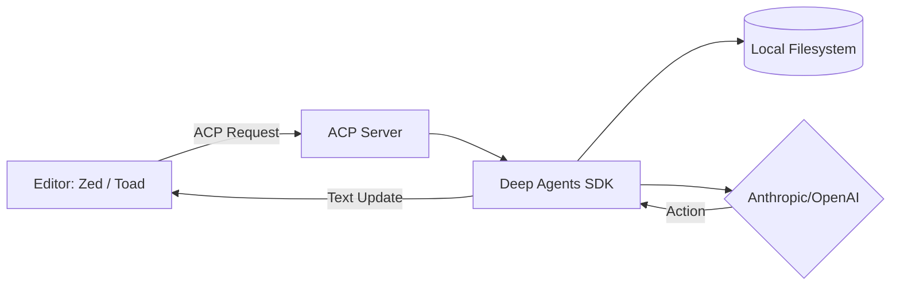

# 🌉 Deep Agents ACP Integration

The **Agent Context Protocol (ACP)** is the bridge that allows your Deep Agents to leave the terminal and inhabit your professional IDE (like Zed). By treating the agent as a standardized protocol, you can use the same "Brain" and "Skills" across different development environments.

### 🔍 Deep Dive: The Protocol Bridge
ACP decouples the **Reasoning Engine** (your agent) from the **User Interface** (the editor). This allows for a seamless "Co-Pilot" experience where the agent has direct access to your editor's buffer and filesystem.



## 🛠️ Module Setup

### Prerequisites
- **[Zed Editor](https://zed.dev/)**: The primary target for this integration.
- **`uv`**: For fast dependency management.

### Installation & Sync
```bash
cd libs/acp
uv sync --group examples
```

### Configuration: The "Zed Bridge"
Add the following to your Zed `settings.json` (Open with `Cmd + ,`):

```json
{
  "agent_servers": {
    "DeepAgents": {
      "type": "custom",
      "command": "/bin/sh",
      "args": ["-c", "cd /path/to/tutorial-ai-agent-harness/libs/acp && ./run_demo_agent.sh"]
    }
  }
}
```

## 🚀 Launching in the Editor
1.  Open Zed's **Agents Panel** (`Cmd + Shift + ?`).
2.  Select **"DeepAgents"** from the provider dropdown.
3.  Start a conversation! The agent can now see your open files and propose edits directly.

## ✅ Lab Challenge: Model-Switching
ACP supports dynamic model switching. Look at `libs/acp/deepagents_acp/server.py`. 
- **Exercise**: Can you configure the server to allow switching between `Claude 3.5 Sonnet` and `GPT-4o` mid-conversation? 
- **Check**: Once configured, check the Zed dropdown menu to see if both models appear.

---

### Acknowledgements
This integration is based on the [Agent Client Protocol](https://agentclientprotocol.com/) standard.
