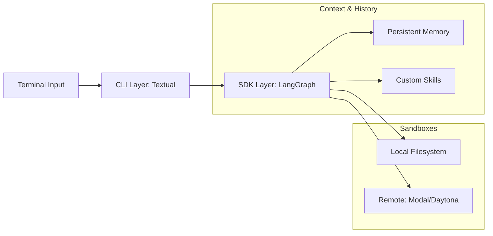

# 🖥️ Deep Agents CLI

The Deep Agents CLI is a high-performance **Terminal User Interface (TUI)** that transforms your shell into an agent-powered development environment. It provides a "batteries-included" experience similar to Claude Code, allowing you to research, code, and deploy without leaving your terminal.

### 🔍 Deep Dive: The TUI Architecture
The CLI isn't just a wrapper; it's a sophisticated orchestrator that manages multiple state streams:



## 🛠️ Module Setup

### Quick Install (Recommended)
Use the one-line installer to get the latest stable version:

```bash
curl -LsSf https://raw.githubusercontent.com/langchain-ai/deepagents/main/libs/cli/scripts/install.sh | bash
```

### Advanced Install (via `uv`)
To include specialized model providers like NVIDIA or Ollama:

```bash
uv tool install 'deepagents-cli[nvidia,ollama]'
```

### Launching the Agent
Simply run `deepagents` in any git-initialized directory. The agent will automatically detect your local files and establish its "workspace."

```bash
deepagents
```

## 🛑 Common Gotchas
- **Git Context**: The CLI works best inside a Git repository. It uses your project structure to prioritize file searches.
- **API Persistence**: Ensure your `ANTHROPIC_API_KEY` is exported in your terminal profile (`.zshrc` or `.bashrc`) to avoid re-authentication errors.

## ✅ Lab Challenge: The CLI Power User
- **Exercise 1**: Open the CLI and use `/search "How does LangGraph handles cycles?"`. Note how the agent uses Tavily to ground its response.
- **Exercise 2**: Extension Challenge. Look at `libs/cli/deepagents_cli/command_registry.py`. Can you find where slash commands are defined? Try adding a simple `hello` command that returns a greeting.

---

<p align="center">
  
</p>
