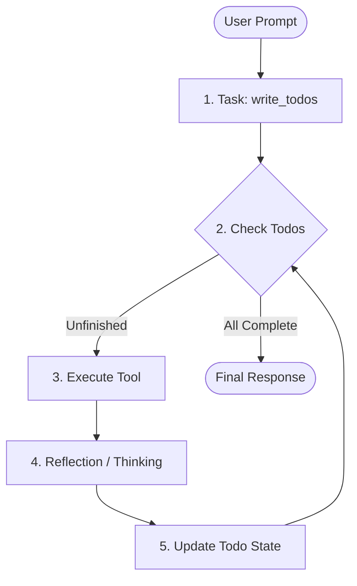

# 🧠 Deep Agents SDK

The Deep Agents SDK is the primary **Harness** for building complex, autonomous agents. Unlike "shallow" agents that simply call tools in a loop, this SDK provides the structural scaffolding needed for **long-horizon planning**, **context management**, and **filesystem persistence**.

### 🔍 Deep Dive: The Deep Agent Pipeline
When you initialize an agent with `create_deep_agent`, the SDK sets up a LangGraph-powered state machine that follows this logic:



### Key SDK Capabilities:
1.  **Thinking Tool**: A metacognition layer that allows the agent to assess its progress between tool calls.
2.  **Context Summarization**: Middleware that prevents your agent from "forgetting" tasks as history grows by automatically summarizing older turns.
3.  **Filesystem-as-Database**: An optimized backend for storage, ensuring your agent shares memory across sessions.

## 🛠️ SDK Setup

### Quick Install
The SDK is distributed as a Python package. For workshop participants, we recommend using `uv` for the fastest experience:

```bash
uv add deepagents
```

### Core Initialization Pattern
```python
from deepagents import create_deep_agent, FilesystemBackend

agent = create_deep_agent(
    # The 'Soul' (Memory/Persona)
    memory=["./AGENTS.md"],
    # The 'Hands' (Local Tool Access)
    tools=[my_custom_tool],
    # The 'Staff' (Delegated Research)
    subagents=load_subagents("./subagents.yaml"),
    # The 'Infrastructure'
    backend=FilesystemBackend(root_dir="./")
)
```

## 🛑 Common Pitfalls
- **Token Limits**: Complex plans generate more history. Always use `create_deep_agent`'s default summarization middleware.
- **Provider Conflicts**: Ensure your `ANTHROPIC_API_KEY` is set if using the default reasoning models.

## ✅ Self-Check Challenge
- Look at the `FilesystemBackend` source code. How does it handle file locks when multiple agents are running in the same directory?
- Try initializing an agent *without* the `write_todos` tool. How does its planning behavior change?
