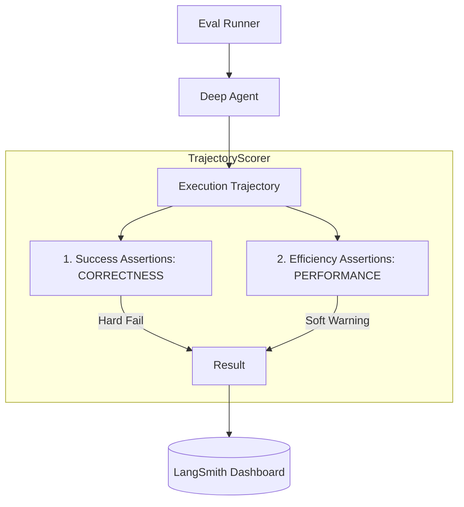

# 🧪 Deep Agents Evals

The **Evaluation Suite** is the scientific engine of the workshop. It allows you to run agents end-to-end against real tasks and objectively measure their **Correctness** and **Efficiency** using a trajectory-based approach.

### 🔍 Deep Dive: Trajectory-Based Scoring
Instead of just checking the final output, we analyze the agent's **Trajector** (every tool call, every thought, every file change). This is achieved through a two-tier assertion model:



## 🛠️ Module Setup

### Prerequisites
- **LangSmith Account**: Essential for visualizing traces. [Signup here](https://smith.langchain.com/).
- **`uv`**: For fast dependency management.

### Configuration
Export your keys to the current shell:

```bash
export ANTHROPIC_API_KEY="sk-ant-..."
export LANGSMITH_API_KEY="lsv2_..."
export LANGSMITH_TRACING=true
```

### Installation
```bash
cd libs/evals
uv sync
```

## 🚀 Running the Benchmarks
To run the standard file-operation benchmarks:

```bash
# Run all file-op evals
LANGSMITH_TEST_SUITE=deepagents-evals uv run --group test pytest tests/evals/test_file_operations.py
```

## ✅ Lab Challenge: The Quality Engineer
- **Exercise 1**: Open `tests/evals/test_file_operations.py`. Can you find an eval that uses `.expect(agent_steps=...)`? What happens if you change that number to 1?
- **Exercise 2**: Write a new test function in a file `tests/evals/test_simple.py` that asserts your "Health Check" agent from Module 1 can correctly count the words in a file. Use `.success(final_text_contains(...))`.

---

- **[Full Eval Catalog](EVAL_CATALOG.md)**: Explore the definitions of all 85+ pre-built evals.
